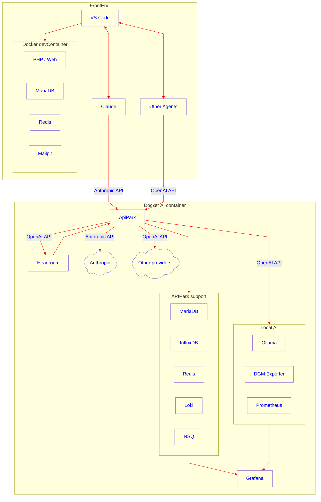

# Agentic-Development-Environment

I am about to embark on developing Visual Laravel
and want to use agentic development to speed up this process.

I also have a high-end (refurbished) laptop
which came with a half decent GPU with 6GB of vRAM
that can be used to run local AI models
(like `qwen2.5-coder-8B)
but nowhere near powerful enough to run
the latest high quality open-source agentic coding models
like GLM-5 or Kimi-K2.5.

But,
whilst I have a huge amount of historical IT experience,
I am completely new to AI agentic coding,
so I am embarking on a voyage of discovery on how to use AI effectively
to create a new complex open-source app.

This repo serves two purposes:

1. Whilst I am creating the environment
it will serve as a blog for my journey; and
2. It will be a source for the AI environment that
supports my agentic development
that can be used by others as a starting point
to speed up their own AI adoption.

## Requirements
1. Agentic development using best tools and practices.
2. Use of leading edge tools at lowest cost
commensurate with making rapid, high quality progress.
3. Priorities:
   A.  Solution quality (code and UI)
   B. Best practice software development
   C. Maximum automation, minimum human input
   D. Reasonable costs (no more than $20/month)
   E. Best speed
   F. Flexibility to e.g. change AI providers later
   F. All other things being equal prefer Open Source
   (because generally less lock-in,
   greater flexibility to change horses)

## Analysis
A few things became very clear very quickly:

1. In general, normal desktop or laptop PCs are
not going to be suitable to run the types of AI models
needed for the more complex parts of quality agentic development,
at least not for the foreseeable future.

2. Thus use of internet hosted AI is going to be essential,
however it can be ***VERY*** easy to either:
   * use up your allowance on
free/fixed price subscriptions; or
   * rack up huge bills on pay-as-you-go services.

3. Whilst not essential,
since I have some local AI capability,
I should try to use it to the best of its capabilities
for the less challenging AI activities
and save the subscription internet services for things
that the local AI cannot achieve successfully.

It also became clear quite quickly that out-of-the box agentic environments
can burn through AI tokens extremely rapidly if they are not optimised,
because in essence AI models need to have:

* High quality prompts that:
   * focus their attention
   * tell them exactly how
   to work efficiently and effectively
   * deliver high quality responses
whilst avoiding hallucinations
* Tools to control the context (AI inputs)
because unless you do this contexts grow like topsy,
and excessive contexts:

   * Dilute the AI's attention
   and lead to poor(er) quality results
   * Reduce what can be done locally, increasing internet AI usage
   * Simply cost more
   (because internet AI is costed in part on the size of your input context)

In addition, I suspect that AIs make repeated calls to LLMs
with the same or similar context, so we should explicitly try to:
* Cache the contexts and responses locally
and only refresh them every (say) 5th time; and/or
* Try to maximise context caching by the LLMs themselves where possible.

## Architectural solution(s)

So far I have identified the need for the following building blocks:

* **Packaging** up my AI services so that they are
easy to create and maintain and run -
and **`Docker`** easily serves this purpose.

It is anticipated that all of the following services could be Dockerised:

* **Context control and optimisation**
so that we don't waste input tokens -
current thought **[`Headroom`](https://github.com/chopratejas/headroom)**

   We then need a way to monitor the effect of `Headroom` on context,
   and possibly to run A/B tests to compare both context size and results
   with and without headroom.

* **Automated LLM selection** - A way for either:
   * the agentic tool (Claude, Antigravity etc.)
   to indicate the type of call it is making
   or the complexity of LLM it needs; or
   * A way to examine the call and
   route it to different LLMs accordingly

   Solution not yet identified

* **AI Routing** to:
   * Centralise the routing to a variety of local and remote models
(possibly converting between e.g. openAI and anthropic API calls)
   * Do local caching
   * Potentially avoid failing AI calls
   by having automated fallback routes
   if a call fails due to e.g.
   a call being too difficult for the model,
   recent usage exceeding subscription limits,
   excessive internet demand,
   or an outage.
   (The philosophy is that it is better to have a slow but successful response than a fast failure).

   **[`LiteLLM`](https://www.litellm.ai/)** and **[`ApiPark`](https://apipark.com/)**
   have been identified for this.

   `ApiPark` has integrated analytics
   which makes its docker container much more complex,
   perhaps making it suitable only for experimental comparison
   of alternative models,
   whilst `LiteLLM` is simpler and perhaps more suited for long term production.
   However `ApiPark` is also configured via a portal which may be a lot easier\
   even in production.

* **Running local LLMs** -
**`Ollama`**

* **Local GPU Monitoring**, which has two elements:

   * Recording the GPU's processor and memory usage
   * Displaying the GPU measurements graphically

   Based on
   [this article](https://dev.to/hakanbaban53/local-llm-ops-building-an-observable-gpu-accelerated-ai-cloud-at-home-with-docker-grafana-4hbi)
   I plan to use:

   * [Nvidia's DGM Exporter]() to expose the GPU metrics
   * [prom/prometheus]() to collect the measurements
   * [Graphana]() to display the measurements graphically
   (and also to analyse both local and internet LLM usage using LiteLLM logs)

* TBD We may also need a **Queuing** system (similar to a caching system)
to queue AI calls when the agentic environment
is doing more things in parallel than you have resources to run
and so you need to queue calls until an AI resource comes free.
This would likely also need to include a priority scheme
so that interactive calls can be given priority
over e.g. background coding tasks.

Finally, I need to ensure that the calls
made by the agentic coding environment
to this Dockerised AI Runtime environment
are themselves optimised,
which effectively means broken down into
small individual steps,
using a range of AI Agent Prompts, Skills, Workflows, MCP Servers etc.
which will:

* Tools to create detailed specifications:

   * requirements
   * architectural designs
   * detailed designs
   * implementation plans
   * individual task plans
   * other agent guidelines & rules
   * human documentation
   * provide agents with contextual memory
   * individual agent coordination & swarm orchestration

* Provide focused local context and focused and up-to-date expertise
to the AI without needing the AI to have to work out for itself
what to select as local context
or research specific expertise
(both of which soak up both AI usage and elapsed time)
e.g.:

   * MD files for specifications, specific prompts, rules etc.
   * Skills
   * MCP Servers
   * etc.

* There are anecdotal examples of how specific prompts can assist AI
to stay focussed and avoid hallucinating,
and whilst these are primarily intended for chat rather than agentic coding
they may still have relevance even when you have a tightly written specification
for the agent to follow.

* I would also like to work out how we can reduce the scope of AI efforts
where normal algorithmic tools can take some of the workload
(in the same way that we would optimise human effort)
e.g.:

   * Why should the AI concern itself specifically with formatting
   when linters can easily do this?
   * The AI should generatively iterate as needed
   to produce the best code it can,
   but (as with humans) there comes a point
   where reading the code again-and-again to see
   whether it can be improved further (i.e. code walk-throughs)
   becomes less effective than stopping and
   attempting to run the test suite to see what errors occur.

* Do agentic engineering rather than vibe coding by
applying best software engineering practices to the coding efforts
e.g.:

  * Test Driven Development -
  create tests first, check they fail, create the code to make the tests pass
  * A broad range of tests - unit, functional, boundary/edge, UI etc.
  * Create PRs rather than using direct commits
  * Locally run (avoiding AI cycles)
  linting/code-formatting,
  static type checking tools etc.
  to clean-up code
  * Domain Driven Development - to break a large app into smaller self contained chunks
  * Package breakout - e.g. if we develop functionality which could be reused by others
  * etc.

   Note: We should attempt to structure linters and tests in a way that they
are run only on the areas of the code that the agent is working on.
If for some reason these run more widely,
this can create scope creep for the agent task
as it attempts to fix issues outside its intended scope -
we will probably need a rule to keep the AI focused on its original scope
and not be distracted by linting or test errors elsewhere in the code base
if they happen to occur.

* Undertake almost all user interaction in a planning phase
to generate quality agentic designs and plans
in order that
coding can run autonomously through to bug-free, tested completion
entirely in the background without human input.

And then :

   * Choosing the right LLMs to run
   both locally and remotely
   for various types of AI calls

   * Automating the choice
   rather than relying on the user
   to manually switch to the most appropriate model.

   * Making the routing more resilient so that e.g.

      * If the call fails locally due to lack of memory
      we either rerun it on a smaller local model
      or switch to an internet model
      * If a remote call fails due to lack of credit or other issue
      we switch to an alternate service.

* Agents identified to try are:

   * Codex
   * Claude
   * Roo
   * Cursor
   * Antigravity
   * [OpenSpec](https://openspec.dev/)
   * [StrongDM Attractor based agents](https://factory.strongdm.ai/products/attractor)

## Early experiences
This is somewhat of a voyage of discovery.
Whilst I am doing internet research to avoid
spending excessive time reinventing everything,
it is easy to get bogged down in endless research
and actually achieve nothing in reality.

So I am trying to have a balance of internet research
and actual experimentation.

* Learning the technologies -
experimenting with LM Studio and Ollama non-dockerised,
and LiteLLM, Ollama and Redis dockerised.

* First AI experience using AntiGravity to set up the docker experiment -
which burned through a week's tokens in an hour due to
giving it unstructured input and letting it build a single excessive context.

Form these I learned quickly that you need to give substantial thought to
creating the right AI environment, and this repo is the result.

It remains to be seen just how useful local AI will be -
and for what type of tasks
(design, planning, coding, testing & bug fixing, editing UI code completion etc. etc.).
Whilst the results for many activities are almost certainly
not going to be as good as a massively bigger and more expensive remote LLM,
a locally hosted LLM can iterate far more affordably than a remote model.

## Choosing IDE and Agentic Tool and Internet AI Subscription

Whilst my own use case is not sufficient to reach
the utopia described by the **[`StrongDM Softwaree Factory`](https://factory.strongdm.ai/)**,
this is a useful inspiration and source of information.

For example, they have a page detailing
which models they use for which tasks and why?
How useful is that?

But here are my thoughts on front-end technology so far:

1. I want a VS-Code based IDE because of the ecosystem and prior experience.

2. Claude and Codex appear to have the best reputation
as desktop agentic coordinators, but my mind is not yet made up on this.
My preference is to go with Open Source, all other things being equal.
OpenSpec appears to be complementary to the choice of agent.]

It seems that you can (to some extent at least)
decouple a choice of Agentic Tool from a choice of Internet Subscription -
Internet AI providers for Kimi-K2.5 Code and GLM-5
state that you can e.g. use their AI with Claude,
but it is unclear:
* What the quality would be doing this?
* Whether e.g. Claude Code will work the same way i.e. skills etc.?
* Whether subscription usage limits stated for a subscription
will match up in r/l usage:

   * There are lots of complaints
   that limits are being reduced
   or usage exaggerated,
   and that coding sessions can be very time limited; but

   * Conversely, when these complaints are articulated,
   other users claim that they don't have these problems.

   It is difficult to decide whether these complaints
   are simply due to the users having
   and inefficient agentic environment which results in
   uncontrolled and excessive contexts,
   or using more calls than optimal to achieve a single task
   to the required quality,
   or whether there is a real issue.

* Inference speeds and token output rates may also be an important factor.

ANNECDOTE: I jumped in (I am normally more cautious)
and purchased a pretty cheap
annual subscription for GLM-5
only to discover that:

1. Following the documented configuration,
Claude didn't work with any of their models
2. GLM-5 wasn't actually included in the subscription -
this wasn't clearly stated up front
(they had removed a previous explicit statement about this)
but instead was buried in the small-print FAQ further down the page.
3. Support is apparently non-existent.
No technical support response after 4 days.
4. My issues are not isolated - many people are complaining.

Lesson learned: Limit potential losses -
don't buy an annual subscription until you have used it for a month
and know it will meet your needs.

## Draft Architectural Diagram

## First attempt

As a first attempt, I have decided to:

1. Start by focusing on a pipeline limited to internet AI,
and not worry about local LLMs to start with.

   Reasons: Simplicity, early requirements likely to be
   requirements analysis, architecture and planning,
   all of which need large models that cannot be hosted locally.

2, Give the Internet service I purchased a final chance
based on support published for someone else's similar problem.

3. If I cannot make that work, then either use
a free (i.e. low volume) AI service,
or cough-up for Claude Opus.

It may take me a few days to find the time to craft this,
but I will report back once I have tried to make this pipeline work.